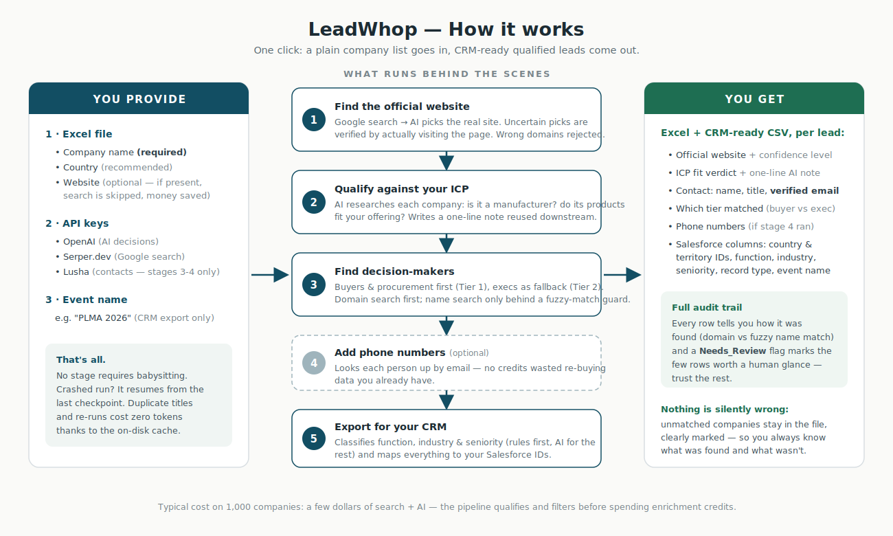
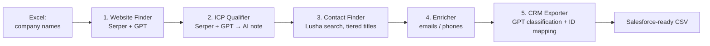

# LeadWhop

**Turn a raw list of company names into CRM-ready, qualified B2B leads — automatically.**

LeadWhop is an end-to-end GTM (go-to-market) automation pipeline. Feed it a plain
Excel file of company names (a trade-show exhibitor list, an industry directory, a
scraped market list) and it will:

1. **Find** each company's official website via Google search (Serper.dev) + LLM validation
2. **Qualify** each company against your ICP with an LLM web-research pass ("is this a manufacturer? does their product fit our offering?")
3. **Discover** decision-makers with tiered, role-based title matching (Lusha Prospecting API)
4. **Enrich** contacts with verified emails and (optionally) phone numbers
5. **Export** a ready-to-import CRM file (Salesforce-compatible), with AI-classified
   business function, industry, sub-industry and seniority level

Built and battle-tested in production at a glass-packaging manufacturer, where it
replaced a fully manual research workflow for international trade-show lead lists.

---

## How it works



## Architecture



Every stage is a standalone module — run the whole chain or any single step from
the Streamlit UI or Python.

## Key engineering decisions

- **Cost-aware LLM usage.** Rules-first classification: deterministic keyword rules
  handle the obvious cases (CEO → C-Suite), and only ambiguous titles fall through
  to `gpt-4o-mini`. All LLM verdicts are memoized in a persistent on-disk cache, so
  re-runs and duplicate titles cost zero tokens.
- **Waterfall enrichment.** Cheap signals first, paid credits last. Enrichment
  credits are only spent on contacts that pass the tier filters.
- **Resumable by design.** Checkpoints after every N rows; a crashed 2,000-company
  run resumes where it stopped.
- **Rate-limit aware.** Reads provider `Reset in N seconds` headers and sleeps
  exactly as long as needed instead of failing or hammering the API.
- **Config over code.** Title tiers, ICP prompts, CRM picklist/ID mappings all live
  in YAML — adapting the pipeline to a new industry means editing config, not code.
- **Hybrid domain verification.** A wrong domain is the most expensive failure in
  the pipeline (every enrichment credit spent on it is wasted). High-confidence
  domains pass a cheap name-token heuristic; only uncertain ones trigger a
  homepage fetch + LLM check. Verification cost is paid on the doubtful minority.
- **Fuzzy-guarded fallback search.** If a domain search finds nobody, the pipeline
  retries by company name — but only accepts hits whose Lusha company name is
  similar enough to ours, or whose domain is a TLD variant (`acme.de` ≈ `acme.com`).
  No silent imports of a stranger's employees.
- **One-click, fully transparent.** The run never stops to ask questions; instead
  every row carries audit columns (`Website_Confidence`, `Match_Method`,
  `Match_Score`, `Needs_Review`) and the UI surfaces exactly which rows deserve a
  human glance. If your input already has a `Website` column, search is skipped
  and the domain is used as-is.

## Quickstart

```bash
git clone https://github.com/<you>/leadwhop.git
cd leadwhop
pip install -r requirements.txt

cp .env.example .env        # add your API keys here — never commit .env
streamlit run app.py
```

Then open the UI, upload `data/demo_companies.xlsx` (bundled fake data) and run
any stage.

### CLI / Python usage

```python
from leadwhop.pipeline import Pipeline

pipe = Pipeline.from_config("config/settings.yaml")
df = pipe.run("data/demo_companies.xlsx", stages=["websites", "qualify"])
```

## Configuration

| File | What it controls |
|---|---|
| `.env` | API keys (`OPENAI_API_KEY`, `SERPER_API_KEY`, `LUSHA_API_KEY`) |
| `config/settings.yaml` | Models, rate limits, checkpoint interval, ICP prompt |
| `config/tiers.yaml` | Role/title keyword tiers for contact discovery |
| `config/crm_mapping.example.yaml` | CRM picklist values and record IDs (replace with your org's) |

## Cost profile (real-world reference)

On a ~1,000-company run in production:

- Website finding + qualification: ~$2–4 of Serper + `gpt-4o-mini`
- Classification for CRM export: < $1 thanks to rules-first + caching
- The dominant cost is always **enrichment credits** — which is exactly why the
  pipeline qualifies and tier-filters *before* spending them.

## Compliance note

This tool orchestrates third-party data providers. You are responsible for using
it in line with each provider's terms of service and with applicable privacy law
(GDPR, KVKK, CCPA) for your use case — especially regarding phone numbers and
onward transfer of personal data.

## Roadmap

- [ ] Email verification stage (pattern-guess + SMTP verification before paid enrichment)
- [ ] Async I/O (`asyncio` + `httpx`) for parallel provider calls
- [ ] Evaluation harness: labeled validation set + accuracy report for every LLM classifier
- [ ] Pluggable enrichment providers (Apollo, Hunter) behind one interface

## License

MIT
